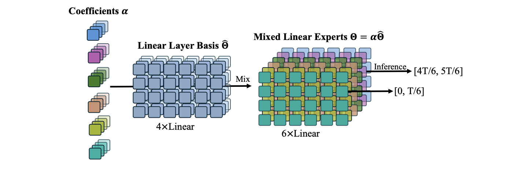

## Remix-DiT

<div align="center">
  
</div>


> **Remix-DiT: Mixing Diffusion Transformers for Multi-Expert Denoising**  
> [Gongfan Fang](https://fangggf.github.io/), [Xinyin Ma](https://horseee.github.io/), [Xinchao Wang](https://sites.google.com/site/sitexinchaowang/)    
> [National University of Singapore](https://nus.edu.sg/)  
📄 [[Arxiv]](https://arxiv.org/abs/2412.05628)


## 0. Introduction
The goal of Remix-DiT is to craft N diffusion experts for different denoising timesteps, yet without the need for expensive training of N independent models. Each expert only hanles a subset of the denoising tasks, and thus can extend the total capacity without heavily increase the active model size on each timestep. To achieve this, Remix-DiT employs K basis models (where K < N) and utilizes learnable mixing coefficients to adaptively craft expert models. 

## 1. Preparation

### Requirements
```bash
pip install -r requirements.txt
```

### Extract ImageNet Features to enable fast training
```bash
torchrun --nnodes=1 --nproc_per_node=1 extract_features.py --model DiT-XL/2 --data-path data/imagenet/train --features-path data/imagenet_encoded
```

### Download Pre-trained DiT-S/2

```bash
mkdir -p pretrained && cd pretrained
wget 
```

## 2. Training


#### RemixDiT-S-4-8
```bash
torchrun --nnodes=1 --nproc_per_node=8 --master_port=22238 train_fast.py --model RemixDiT-S/2 --load-weight pretrained/DiT_S_2_2M.pt --data-path data/imagenet_encoded --epochs 20 --prefix RemixDiT-S-4-20-100K --ckpt-every 50000 --n-basis 4 --n-experts 20
```

#### RemixDiT-S-4-20
```bash
torchrun --nnodes=1 --nproc_per_node=8 --master_port=22238 train_fast.py --model RemixDiT-S/2 --load-weight pretrained/DiT_S_2_2M.pt --data-path data/imagenet_encoded --epochs 20 --prefix RemixDiT-S-4-8-100K --ckpt-every 50000 --n-basis 4 --n-experts 20
```

## 3. Evaluation

### DDP Sampling
```bash
torchrun --nnodes=1 --nproc_per_node=8 sample_ddp.py --model RemixDiT-S/2 --ckpt outputs/RemixDiT-S-4-20-100K/checkpoints/0100000.pt
```

### FID (Requires Tensorflow 2.0)

Please refer to [https://github.com/openai/guided-diffusion/tree/main/evaluations](https://github.com/openai/guided-diffusion/tree/main/evaluations) for the ``VIRTUAL_imagenet256_labeled.npz``.
```bash
python evaluator.py data/VIRTUAL_imagenet256_labeled.npz PATH_TO_YOUR.npz
```

## Acknowledgments
This project was built on [DiT](https://github.com/facebookresearch/DiT) and [ADM](https://github.com/openai/guided-diffusion).

## BibTeX
```bibtex
```
